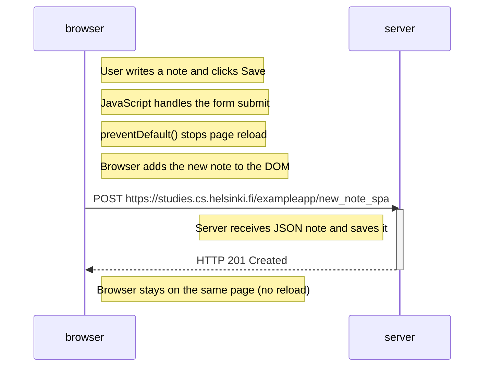

```mermaid
sequenceDiagram
    participant browser
    participant server

    Note right of browser: User writes a note and clicks Save

    Note right of browser: JavaScript handles the form submit
    Note right of browser: preventDefault() stops page reload

    Note right of browser: Browser adds the new note to the DOM

    browser->>server: POST https://studies.cs.helsinki.fi/exampleapp/new_note_spa
    activate server
    Note left of server: Server receives JSON note and saves it
    server-->>browser: HTTP 201 Created
    deactivate server

    Note right of browser: Browser stays on the same page (no reload)
```